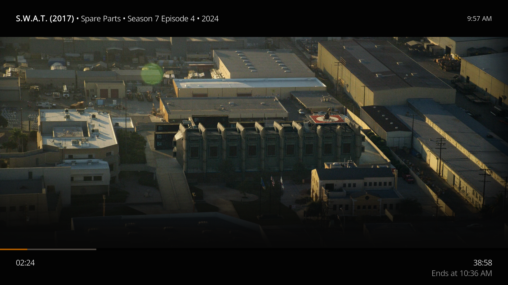
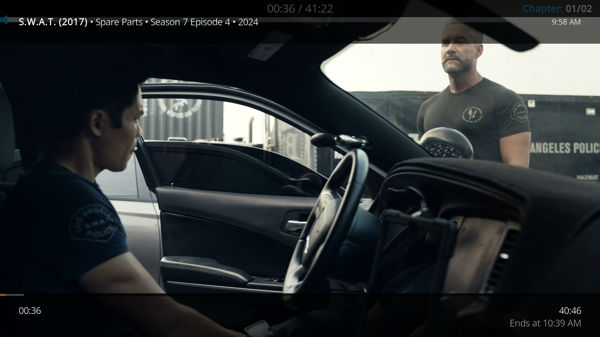
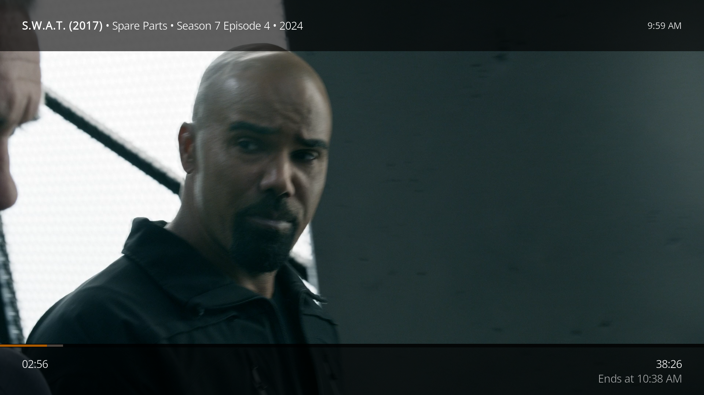

# Temporary transparent seek-overlay build

This temporary build is PlexMod 1.3.19 with two visual fixes:

- seeking no longer adds PlexMod's opaque `player-fade.png` blackout;
- an optional LibreELEC companion hides Estuary's duplicate blue seek header
  only while PlexMod is active.

The title, wall clock, playback times, and PlexMod timeline remain visible.

## Install PlexMod

1. Download `script.plexmod-1.3.19.1-seek-overlay-fix.zip` from the
   [temporary release](https://github.com/vincent71711/plex-for-kodi/releases/tag/seek-overlay-fix-1.3.19.1).
2. In Kodi, open **Add-ons → Install from zip file** and select the ZIP.
3. Turn off automatic updates for PlexMod while testing this build.

That removes the opaque blackout. Users of stock Estuary may then see its
previously hidden blue chapter/seek header. LibreELEC users can remove that too
with the companion below.

## Install the LibreELEC Estuary companion

From a computer with SSH access to LibreELEC, replace `LIBREELEC_IP` with the
box's IP address and run:

```sh
scp install-libreelec-estuary-fix.sh root@LIBREELEC_IP:/storage/
ssh root@LIBREELEC_IP 'sh /storage/install-libreelec-estuary-fix.sh'
```

This companion is deliberately PlexMod-specific. Estuary's native header still
works for local files and every other Kodi add-on.

## Before and after

Original PlexMod blackout:



Blue Estuary header exposed after removing only the blackout:



Final result:



## Remove the LibreELEC companion

```sh
ssh root@LIBREELEC_IP 'systemctl disable --now kodi-hide-seek-header.service; rm /storage/.config/system.d/kodi-hide-seek-header.service /storage/.config/kodi-overrides/Custom_1109_TopBarOverlay.xml; systemctl daemon-reload; systemctl restart kodi'
```

## Best distribution route

1. **PlexMod:** merge the one-line fade-condition change so PlexMod stops adding
   the blackout during ordinary seeks.
2. **Kodi/Estuary:** add a generic opt-out property for applications that draw
   their own complete seek interface; PlexMod should set it only while active.
3. **Normal updates:** after both upstream releases include the changes, retire
   this temporary build and the LibreELEC companion.

## Scope

This is an unofficial testing build. It is based on PlexMod 1.3.19 and retains
the project's GPL-2.0 license and original attribution.
